# VoiceItems

**Maintain and edit lists with voice control via Cursorless extension - apply filters, sorts, and navigate easily.**

VoiceItems provides quick-pick and editor-based navigation for lists in the current document while preserving full Cursorless editing capabilities in the original text editor. Perfect for managing tasks, todo lists, and any structured text files.

## Features

### 📝 Multiple File Format Support
- **`.tasks`/`.todo`/`.task` files**: Checkbox syntax `[ ]` and `[x]`, priority markers `!low`, `!medium`, `!high`, `!critical` (defaults; configurable via the `voiceitems.priorities` setting) 
- **Markdown files**: Standard list items with optional task checkboxes `- [ ]` and `- [x]`
- **Plain text files**: Any `.txt` or `.list` file with line-based items
- **Common syntax**: Tags `#tagname`, projects `@projectname` work across all formats

### 🎯 Keyword Filtering
- **Keyword search**: Find items by text, tags, or projects in the current document

### 🚀 QuickPick & Editor Integration
- **QuickPick**: Show a voice-friendly list of items from the current document
- **Jump to line**: Select an item and jump directly to its line in the editor
- **Toggle complete**: Mark tasks complete/incomplete directly in the editor

### ⚡ Performance & Convenience
- **Large file warning**: Get notified when files exceed ~1000 lines
- **Keyboard shortcuts**: Quick access to common operations (via commands)


## Usage

### Quick Start
1. Open a supported file (`.tasks`, `.md`, `.txt`, etc.)
2. The **List Items** view appears in the Explorer sidebar
3. Use toolbar buttons or commands to filter/sort
4. Click any item to jump to its line in the editor
5. Edit directly in the text editor with full Cursorless support

### Task File Format (`.tasks`)
```
[ ] Incomplete task !high #tag @project
[x] Completed task !medium
  [ ] Nested sub-task
```

### Markdown Format (`.md`)
```markdown
- [ ] Todo item #important
- [x] Done item @myproject
  - [ ] Nested item
```

### Commands
- **Search by keyword**: `VoiceItems: Search by Keyword` — set a filter used by the QuickPick
- **Clear keyword filter**: `VoiceItems: Clear Keyword Filter`
- **Show items (Quick Pick)**: `VoiceItems: Show Items (Quick Pick)` — voice-friendly list selection from the current document
- **Show items by priority**: `VoiceItems: Show Items by Priority` — pick one or more priorities to show matching items in the QuickPick
- **Show incomplete items**: `VoiceItems: Show Incomplete Items` — show only uncompleted tasks in the QuickPick
- **Show completed items**: `VoiceItems: Show Completed Items` — show only completed tasks in the QuickPick
- **Show time range filters**: `VoiceItems: Show Time Range Filters` — drill into date ranges (Last hour, Today, Last 24 hours, Last 7 days, Last 30 days, Last year, or Custom), show counts and jump to the first matching row
- **Toggle complete**: `VoiceItems: Toggle Complete` — toggle the checkbox on a specified line
- **Show Markdown headings**: `VoiceItems: Show Markdown Headings` — navigate by headings in a Markdown file (highlights headings in the active editor while QuickPick is open; line numbers are not shown)

### Command diagram 🔧

A visual overview of available commands and their drilldown/interaction paths.

```mermaid
flowchart LR
  SIQ["Show Items (Quick Pick)"]
  SK["Search by Keyword"]
  CK["Clear Keyword Filter"]
  SKM["Show Keyword Matches"]
  SMH["Show Markdown Headings"]
  SPI["Show Items by Priority"]
  SII["Show Incomplete Items"]
  SCI["Show Completed Items"]
  STR["Show Time Range Filters"]
  TC["Toggle Complete"]
  IP["Increase Priority"]
  DP["Decrease Priority"]
  JTL["Jump to Line"]

  SK --> SKM
  SKM --> JTL
  SK -->|sets filter then| SKM
  SIQ -->|if keyword set| SKM
  SIQ -->|select item| JTL
  SMH -->|select heading| JTL
  SPI -->|pick priorities → select item| JTL
  SII -->|select item| JTL
  SCI -->|select item| JTL
  STR -->|select range / custom| JTL
  TC -.->|modifies file| File[File]
  IP -.->|modifies file| File
  DP -.->|modifies file| File
  CK -.->|clears filter| SK
```




### Keyboard Shortcuts
- `Ctrl+Alt+F` / `Cmd+Alt+F`: Search by keyword (run command)
- You can bind the QuickPick or Toggle commands to your preferred keys via VS Code keyboard shortcuts.

### Voice tips
- Use **Show Items (Quick Pick)** and speak the item number (e.g., "one" or "three") to jump to an item quickly.

#### Voice Commands (Talon examples) 🔊

If you're using Talon or another voice-macro engine, you can map spoken phrases to extension commands. Here are some example Talon mappings you can drop into your Talon scripts:

```talon
voice items:
    key(f1)
    sleep(100ms)
    insert("VoiceItems: ")
decrease priority:
    user.vscode("voiceitems.decreasePriority")
increase priority:
    user.vscode("voiceitems.increasePriority")
toggle complete: user.vscode("voiceitems.toggleComplete")
voice items pick: user.vscode("voiceitems.showItemsQuickPick")
voice items search: user.vscode("voiceitems.searchKeyword")
```

These mappings call the extension's VS Code commands (for example, `voiceitems.toggleComplete`, `voiceitems.increasePriority`, etc.). Adjust the spoken phrases and timing to suit your own voice workflow.

### Configuration

- **Priorities**: The list of supported priorities is configurable via the `voiceitems.priorities` setting (ascending order: lowest → highest). By default this extension uses GitHub-style priorities: `low`, `medium`, `high`, `critical`.

## Requirements

- VS Code 1.107.0 or higher
- Optional: [Cursorless](https://marketplace.visualstudio.com/items?itemName=pokey.cursorless) for voice editing

## Known Issues

- Files with more than ~1000 lines may experience performance degradation
- Hierarchical relationships require consistent indentation (2 spaces per level)

## Release Notes

### 0.0.1

Initial release:
- Support for `.tasks`, Markdown, and plain text files
- Filter, sort, and group functionality
- Jump-to-line navigation
- Keyword search
- Auto-refresh on file changes
- Large file warnings

---

